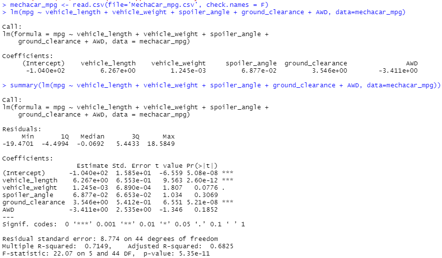
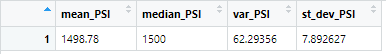
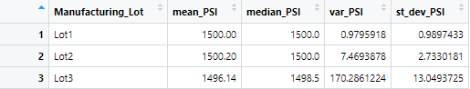
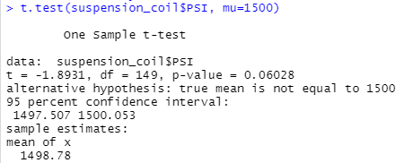
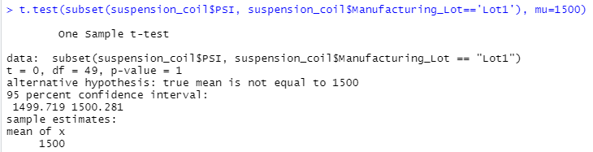
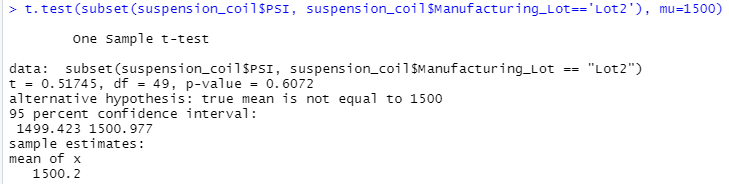
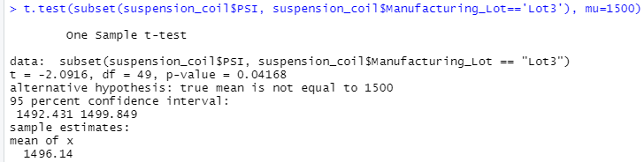

# mechacar_statistical_analysis

## Project Overview
---
A few weeks after starting my new role, I am approached by upper management about a special project. AutosRUs’ newest prototype, the MechaCar, is suffering from production troubles that are blocking the manufacturing team’s progress. AutosRUs’ upper management has called on me and the data analytics team to review the production data for insights that may help the manufacturing team.

## Linear Regression to Predict MPG
---

    -   Which variables/coefficients provided a non-random amount of variance to the mpg values in the dataset?
        - Vehicle Length and Ground Clearance are both coefficients that show a non-random amount of variance to the MPG values.

    -   Is the slope of the linear model considered to be zero? Why or why not?
        - Because the P-Value is far below the significance level of .05, the slope is not considered to be zero.

    -   Does this linear model predict mpg of MechaCar prototypes effectively? Why or why not?
        - The linear model does predict the mpg of the prototypes because the R-Squared value is greated than 70%, meaning there is a strong strength correlation.

## Summary Statistics on Suspension Coils
---
### Total Summary

### Lot Summary

    - The design specifications for the MechaCar suspension coils dictate that the variance of the suspension coils must not exceed 100 pounds per square inch. Does the current manufacturing data meet this design specification for all manufacturing lots in total and each lot individually? Why or why not?
        - In total, our suspension coils are meeting standards as the total variance is under 100 PSI, but when we look at the Lot summary, we can see that there was an issue with the batch from Lot 3, where they are not meeting standards and have a variance of 170 PSI, well over the required PSI variance limit.

## T-Tests on Suspension Coils
---
After identifying a concern with Lot 3 of the suspension coils, T-Tests were run on the full lot as well as the individual lots to compare against the population mean of 1500psi.

### Total Lot T-Test

    While reviewing the full lot of suspension coils we find the P-Value = 0.06. Assuming our significance level was the common 0.05 percent; we do not have sufficient evidence to reject the null hypothesis, and find that the two means are statistically similar.

### Lot 1 T-Test

    While reviewing the lot 1 of suspension coils, we find the P-Value = 0.1. Assuming our significance level was the common 0.05 percent; we do not have sufficient evidence to reject the null hypothesis, and find that the two means are statistically similar.

### Lot 2 T-Test

    While reviewing the lot 2 of suspension coils, we find the P-Value = 0.06. Assuming our significance level was the common 0.05 percent; we do not have sufficient evidence to reject the null hypothesis, and find that the two means are statistically similar.

### Lot 3 T-Test

    While reviewing the lot 3 of suspension coils, we find the P-Value = 0.04. Assuming our significance level was the common 0.05 percent; we do have sufficient evidence to reject the null hypothesis, and find that the two means are not statistically similar

## Study Design: MechaCar vs Competition
---
In an effort to compare mechacar to it's competition, there are several additional metrics to be reviewed. some examples of these might include initial cost, city vs. highway fuel efficiency, horse power, maintenance cost, or safety rating. With a focus metrics most important to consumers, initial cost and maintenance costs will be the focus of my upcoming tests.

### Hypothesis:

    Null Hypothesis: MechaCars have no difference in initial cost compared to its competitors, and have no difference in maintenance costs in comparison to competitors.

    Alternative Hypothesis: MechaCars have a difference in initial cost compared to its competitors, and have a difference in maintenance costs in comparison to competitors.

### Tests to be Performed:
    For this study we will use a 2-sample T-Test to compare the means from both populations.

### Data Requirements
    In order to complete this analysis, we will need to gather competitor data around cost per make of vehicle to compare to MechaCar's equivilent models and historical data surrounding competitor maintenance costs vs. our anticipated maintenance costs.

